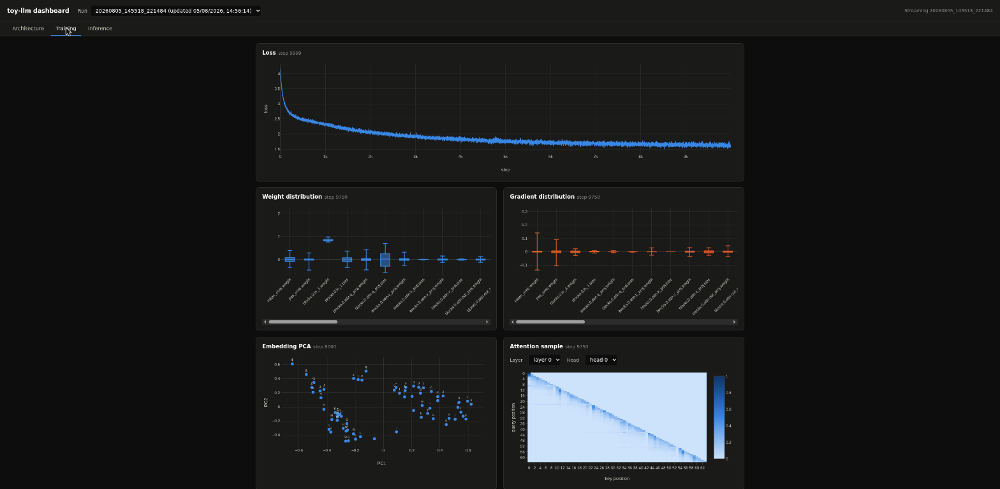
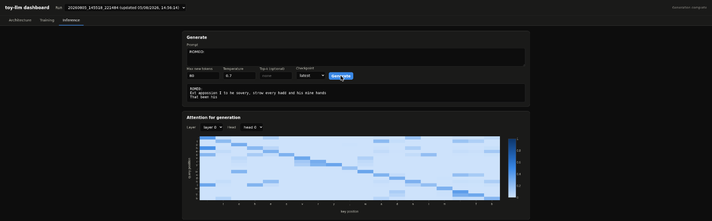
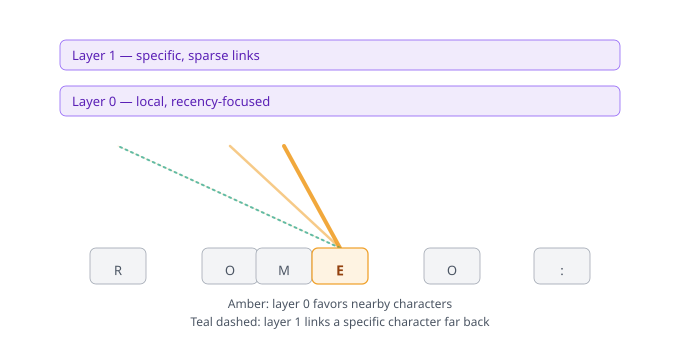
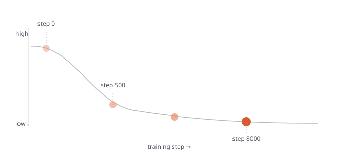
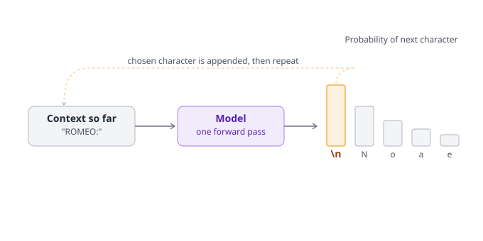
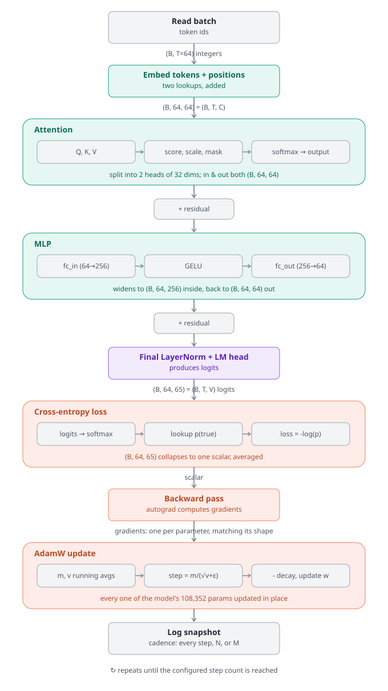

# toy-llm

A small hand-written transformer for visualizing architecture, training, and inference.
See [DESIGN.md](DESIGN.md) for the reasoning behind the choices below.

## Setup

1. Create the pyenv virtualenv (Python 3.12.12):
```bash
   pyenv virtualenv 3.12.12 toy-llm
```

2. Pin this project to it (creates `.python-version`, auto-activates on `cd`):
```bash
   cd toy-llm
   pyenv local toy-llm
```

3. Install dependencies:
```bash
   pip install -r requirements.txt
```

4. Verify GPU is visible to torch:
```bash
   python -c "import torch; print(torch.cuda.is_available())"
```
   Should print `True`.

## Workflow

This project has two stages, run as separate processes:

1. **Train a model** ([Training](#training)) — `python train.py` writes
   checkpoints and a streamed log to `runs/<run_id>/`.
2. **Run the dashboard** ([Dashboard](#dashboard)) — a browser UI to watch
   that training run live, inspect the trained model's architecture, and try
   inference against any of its checkpoints.

The dashboard doesn't need training to be finished, or even started, first —
it just tails whatever's in `runs/`, so it's fine to start it before,
during, or after a `train.py` run.

## Training

Training and the dashboard are separate processes — run them side by side to
watch a run in progress.

```bash
python train.py
```

Each invocation starts a new run, writing checkpoints and a streamed
`snapshots.jsonl` log to a fresh `runs/<timestamp>_<id>/` directory. Useful
flags:

- `--max-steps 2000` — total training steps
- `--log-every 50` — weight/gradient histogram + attention-sample cadence
- `--checkpoint-every 500` — checkpoint + embedding-PCA cadence
- `--n-layer` / `--n-head` / `--n-embd` / `--block-size` — model size
- `--batch-size 32` — samples per gradient step

### Choosing parameters

This project's priority is legibility over capability (see [DESIGN.md](DESIGN.md)), so
pick these with "what will this look like in the dashboard" in mind rather
than optimizing for loss:

- **Model size** (`n_layer`, `n_head`, `n_embd`, `block_size`): keep small.
  `n_layer × n_head` is how many attention heatmaps you browse in the
  selector, and `n_embd` is what gets PCA'd to 2D — both get hard to read
  past a handful. `2/2/64/64` (~108K params) is a good default: enough
  structure to compare early vs. late layers, small enough that the
  parameter table and bar chart in the Architecture tab don't need
  scrolling. The GPU (GTX 1650, 4GB) is not the constraint here.
- **`max_steps`**: 300 is a quick smoke test — enough to confirm the
  pipeline and dashboard work end to end, but the loss curve barely
  flattens. 2000 still shows visible descent rather than a plateau
  (loss dropped ~0.22 in the last 1000 of those steps); on this
  model/dataset it takes ~8000–10000 steps before the curve actually
  flattens out (in one measured run, the last 5000 steps only bought
  another ~0.12) — that's the length worth using if the point is to
  see a full convergence curve, not just a downward trend.
- **`log_every` ("N")**: trades a smoother-looking histogram/attention
  animation against per-snapshot GPU→CPU overhead. Aim for ~15–30
  snapshots total, i.e. `max_steps / 20`.
- **`checkpoint_every` ("M", must be `M >> N`)**: controls how many
  points you get in the Architecture tab's checkpoint selector. Each
  checkpoint is a full state dict (~1.3MB at this model size) plus an
  embedding PCA pass — cheap, so pick based on how many points-in-time
  you want to compare (3–5 is usually plenty).
- **`batch_size`**: smaller batches (e.g. 16) give a noisier, more
  visually "alive" loss curve; memory isn't a real constraint at this
  scale either way.

Two presets:

```bash
# Quick smoke test — verify the pipeline and dashboard render correctly
python train.py --max-steps 300 --log-every 20 --checkpoint-every 100 \
  --n-layer 2 --n-head 2 --n-embd 64 --block-size 64 --batch-size 16

# Longer run — full convergence curve (plateaus around step ~8000-10000
# on this model/dataset), several checkpoints to browse
python train.py --max-steps 10000 --log-every 250 --checkpoint-every 2000 \
  --n-layer 2 --n-head 2 --n-embd 64 --block-size 64 --batch-size 32
```

## Dashboard

A browser UI for inspecting a run, with three tabs: **Architecture** (static
model config, parameter counts, and the full parameter table), **Training**
(loss, weight/gradient distributions, embedding PCA, and attention samples,
all updating live as `train.py` progresses), and **Inference** (type a
prompt, generate from any checkpoint, and see the attention weights behind
that generation).

The dashboard backend serves the frontend too, so one command runs both:

```bash
uvicorn dashboard.backend.app:app --reload
```

Then open `http://127.0.0.1:8000/` in a browser.

- Run it from the repo root, so the default `runs_dir="runs"` resolves correctly.
- `--reload` restarts the server on backend code changes; not needed for
  frontend-only edits, since `index.html` is served fresh from disk each
  request.
- Add `--port` if 8000 is already taken.
- Add `--host 0.0.0.0` to make it reachable from another machine on the
  network — uvicorn defaults to `127.0.0.1`, which only accepts connections
  from the same machine. There's no authentication on any endpoint, so only
  do this on a trusted network (see DESIGN.md's open questions).
- The dashboard can be started before or after `train.py` — it just reads
  whatever's in `runs/` and tails the file. Pick the run from the "Run"
  dropdown and open the **Training** tab to watch loss, weight/gradient
  distributions, embedding PCA, and attention samples update live as
  training progresses.



Once a run has at least one checkpoint, open the **Inference** tab to try
prompts against it — the response streams in, and the attention weights
behind that specific generation are plotted alongside it (see
[Findings](#findings) for how to read those).



## Findings

[`docs/findings.md`](docs/findings.md) documents observations from an actual
training run — parameter distribution, loss/weight/gradient dynamics,
embedding PCA across checkpoints, and attention patterns from both training
and generation.

`docs/embedding_pca_compare.html` is a self-contained interactive chart
referenced from those findings; GitHub only shows HTML files as source, so
view it rendered via
[htmlpreview.github.io](https://htmlpreview.github.io/?https://raw.githubusercontent.com/codeinthecreek/toy-llm/main/docs/embedding_pca_compare.html)
instead.

## Intuitive views of how the LLM works

The model trains on a tiny-shakespeare corpus with character-level
tokenization (see [DESIGN.md](DESIGN.md) for why) — so "characters" below means literal
letters/punctuation, and "ROMEO:" is an actual prompt this project's model
was given. The three illustrations below simplify the core ideas, but the
specific behaviors they call out (the layer 0/layer 1 attention split, the
loss curve's shape) aren't hypothetical — they're what was actually observed
on a real run of this model, documented in detail in
[`docs/findings.md`](docs/findings.md).

### How attention lets the model read text



The bottom row is a sequence of characters ("ROMEO:"). Each layer above is
a full pass over the whole sequence, and the lines show attention: how
much each token "looks at" every other token when deciding what comes
next. Layer 0's lines cluster on nearby characters — a recency bias.
Layer 1's dashed line reaches further back for one specific character —
sparser, more selective linking, consistent with a deeper layer building
on the previous layer's output rather than raw token embeddings. This
split is exactly what the trained model's real attention weights show —
see "Attention patterns" in `docs/findings.md`.

### Training as descending a loss landscape



The vertical axis is loss (how wrong the model's predictions are); the
ball is the model's current state, always rolling toward lower loss.
Early on the surface is steep, so a single training step buys a big drop.
Later, the surface flattens, so each step only nudges the ball a little —
matching this project's actual loss curve, which falls sharply in the
first ~500 steps, then decays slowly out to 8000-10,000 steps.

### Inference: generating one character at a time



This is what happens *after* training, using the model's learned weights
(a saved checkpoint) rather than the random weights it started with: the
context goes through one forward pass of the model, which outputs a
probability for every character in the vocabulary rather than a single
answer. The most likely (or sampled) character is chosen, appended onto
the context, and the loop runs again with one more character in view —
this is why generation is inherently sequential, one pass at a time.

## Detailed pipeline of a single training step

The illustrations above are the intuitive picture; this is the literal one
— the same single training step, but with every stage and tensor shape as
actually implemented in `model/`, from the raw batch to the AdamW update.



A single training step: a batch of characters is embedded, passed through
the transformer blocks (attention, then MLP, each wrapped in a residual
connection), projected to logits over the vocabulary, scored against the
true next character via cross-entropy loss, and used to update every
parameter via backward pass and AdamW. The tensor shape is annotated at
each handoff — notably, the residual stream stays a constant (B, 64, 64)
through every block; only the LM head expands it to (B, 64, 65) to score
against the vocabulary, and only the backward/AdamW steps operate in
per-parameter shape space rather than per-token shape space.

### From diagram to code

The diagram's boxes split into two ownership zones. The teal band (Embed
through the second residual) is internal to a single `model(x)` call —
`train.py` never sees inside it. Everything in gray or orange is
orchestration code in `train.py` that treats the model as one opaque,
differentiable function.

**Inside the model — one `model(x)` call, three levels of `nn.Module`:**

- **Embed tokens + positions**: two `nn.Embedding` tables owned directly by
  `GPT` — `token_emb` (`vocab_size × n_embd`) and `pos_emb`
  (`block_size × n_embd`) — looked up and summed in `GPT.forward`
  (`model/gpt.py`). `GPT`'s class docstring is explicit that this whole
  model is "wired up explicitly rather than via `nn.TransformerEncoder`, so
  the forward pass stays inspectable end to end" — these two embedding
  tables are the first instance of that: nothing fuses them, `GPT` just
  owns and adds them.
- **Attention**: one `Block`'s call into `self.attn`, a
  `CausalSelfAttention` instance (`model/attention.py`) built from four
  plain `nn.Linear` layers (`q_proj`, `k_proj`, `v_proj`, `out_proj`) and
  two `nn.Dropout` layers. Its own docstring names the design choice
  directly: "written out rather than delegated to `nn.MultiheadAttention`,
  so the forward pass can be inspected head-by-head." The diagram's three
  sub-boxes are that written-out sequence — the `nn.Linear` projections
  reshaped into heads; a manual scaled dot-product (`q @ k.transpose(...)`)
  masked using a causal `torch.tril` buffer registered in `__init__`; then
  `F.softmax` and a weighted sum back through `out_proj`.
- **+ residual (first)**: not a `torch.nn` component at all — `Block.forward`
  (`model/block.py`) adds the attention output back onto its
  un-normalized input with a plain `+`.
- **MLP**: `Block`'s call into `self.mlp`, an `MLP` instance built from
  `nn.Linear` (`fc_in`, expands to `4 × n_embd`) → `nn.GELU` →
  `nn.Linear` (`fc_out`, contracts back) → `nn.Dropout`. Its docstring —
  "Two-layer feed-forward network with GELU, written out explicitly" —
  is the same convention as attention, just with fewer steps to hide since
  no fused "MLP module" exists in `torch.nn` to avoid in the first place.
- **+ residual (second)**: `Block.forward` again, same `+` pattern as the
  first residual. `Block`'s own docstring summarizes both residual hops in
  one line: "Pre-norm transformer block: LN -> attention -> residual, LN ->
  MLP -> residual."
- **Final LayerNorm + LM head**: back to `GPT` itself — an `nn.LayerNorm`
  (`ln_f`) and a bias-free `nn.Linear` (`lm_head`), run once after the
  block loop, owned by neither `Block`. `lm_head.weight` is tied to
  `token_emb.weight` rather than being an independently learned matrix.

The diagram draws one Attention → residual → MLP → residual unit, but
that's a single `Block`; `GPT.forward` loops it `n_layer` times via
`self.blocks`, an `nn.ModuleList` of `Block` instances — the `nn.Module`
container that stands in for the `nn.TransformerEncoder` the docstring
says this project deliberately avoids. The diagram shows one iteration of
that loop, invisible at this zoom level.

**Outside the model — plain orchestration in `train.py`'s training loop:**

- **Read batch**: `get_batch` — plain tensor indexing (`torch.randint`,
  `torch.stack`), no `nn.Module` or `torch.nn` component involved; this is
  where the loop hands data to the model.
- **Cross-entropy loss**: a single `F.cross_entropy` call — a
  `torch.nn.functional` function, not a class with its own learned
  parameters, and the first point after `model(x)` where control returns
  to `train.py`'s flat script rather than a class hierarchy.
- **Backward pass**: `loss.backward()`, one line — the diagram's biggest
  compression. It stands for `torch.autograd` walking back through every op
  in every box above it (the `nn.Linear` projections, `F.softmax`,
  `nn.GELU`, both `nn.LayerNorm`s, the `nn.Embedding` lookups) in reverse.
  None of that traversal logic lives in `model/` or `train.py` — it's
  PyTorch's autograd engine executing against the graph that was built
  implicitly, op by op, while `GPT.forward` ran.
- **AdamW update**: `optimizer.step()`, one line, where `optimizer` is a
  `torch.optim.AdamW` instance constructed once against
  `model.parameters()`. `model/` contributes nothing here directly beyond
  that parameter list — `AdamW` reads each tensor's `.grad`, updates its
  own internal per-parameter moment estimates, and writes the result back
  into `.data` in place.
- **Log snapshot**: `SnapshotLogger` plus the `*_event` helper functions.
  This is the one place `train.py` reaches back *into* the model from
  outside — `attention_sample_event` calls
  `model(..., return_intermediates=True)` to pull out the `attn_weights`
  that `CausalSelfAttention.forward` computed internally, via an optional
  return path threaded through `GPT` → `Block` → `CausalSelfAttention`
  specifically to punch a hole in that encapsulation for this one caller.

In short: the teal zone is three levels of `nn.Module` nesting that mirror
the diagram's containers almost exactly; everything outside it is flat
orchestration code that treats the model as one differentiable function
plus a `.parameters()` list.

## Notes
- `pyenv local toy-llm` writes `.python-version` — as long as you `cd` into the repo with pyenv's shell hook active, the venv activates automatically. No manual `source .venv/bin/activate` needed.
- To list existing pyenv virtualenvs: `pyenv virtualenvs`
- To remove this one if you need to rebuild it: `pyenv uninstall toy-llm`

## License

BSD 3-Clause. See [LICENSE](LICENSE).
